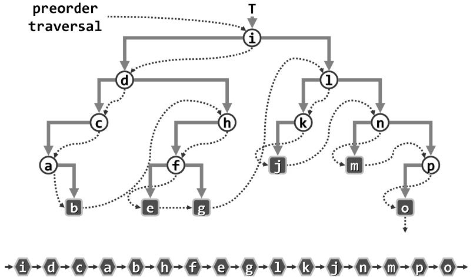
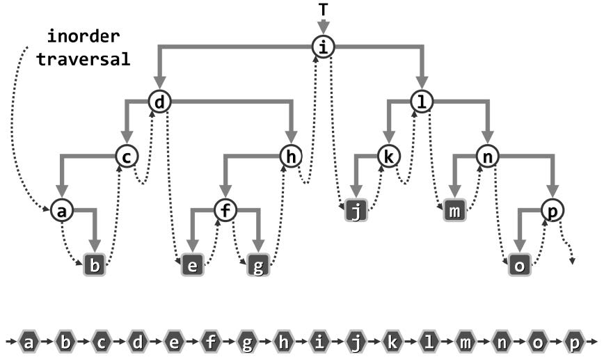
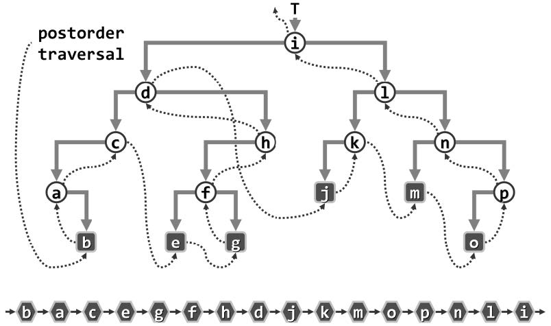
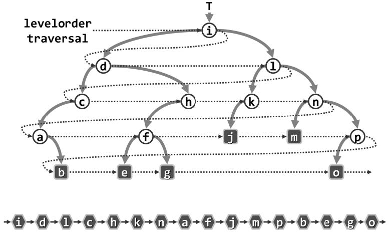

# 遍历二叉树

> 遍历操作之于二叉树的意义，在于为许多相关算法的实现提供了通用框架和基本接口。
> 从算法策略的角度看，这一过程也等效于将半线性的树形结构转换为线性结构。

# 算法类型

## 1. VLR, LVR, LRV型

> * 总结而言，这三种遍历方法均可实现为非常简明的递归版，但在实际中最好使用其**迭代版**：
>   * 递归版与迭代版的时间复杂度在渐进意义下实际上是相同的，均为线性时间；
>   * 但递归版的时空复杂度的常系数更大，因为实现递归需要额外的程序开销。
> * 三种遍历方法中：
>   * 先序遍历与后序遍历序列并非简单的逆序关系;
>   * 对于中序遍历，各节点在遍历序列中的局部次序与按照有序树定义所确定的全局左、右次序完全吻合，故而中序遍历在很多方面扮演着重要的角色。
> * 三种遍历方法的迭代实现均使用了辅助结构`栈`，与之形成对比的是，BFS型的层次遍历法使用了辅助结构`队列`。

* ### 先序遍历

* ### 中序遍历

* ### 后序遍历

## 2. BFS型

* ### 层次遍历

