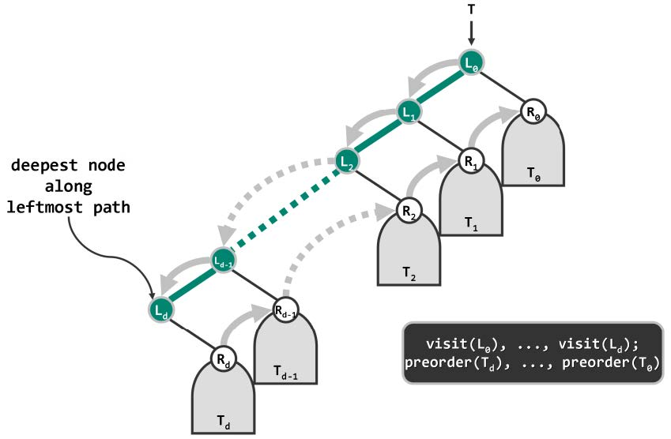

# 递归式
```C++
template <typename T, typename VST> //元素类型、操作器
void travPre_R(BinNodePosi(T) x, VST& visit) { //二叉树先序遍历算法（递归版）
    if (!x) return;
    visit(x->data);
    travPre_R(x->lChild, visit);
    travPre_R(x->rChild, visit);
}
```
# 迭代式
```C++
//从当前节点出发，沿左分支不断深入，直至没有左分支的节点；沿途节点遇到后立即访问
template <typename T, typename VST> //元素类型、操作器
static void visitAlongLeftBranch(BinNodePosi(T) x, VST& visit, Stack<BinNodePosi(T)>& S) {
    while (x) {
        visit(x->data); //访问当前节点
        S.push(x->rChild); //右孩子入栈暂存（可优化：通过刷断，避免空的右孩子入栈）
        x = x->lChild; //沿左分支深入一层
    }
}

template <typename T, typename VST> //元素类型、操作器
void travPre_I2(BinNodePosi(T) x, VST& visit) { //二叉树先序遍历算法（迭代版#2）
    Stack<BinNodePosi(T)> S; //辅助栈
    while (true) {
        visitAlongLeftBranch(x, visit, S); //从当前节点出发，逐批访问
        if (S.empty()) break; //直到栈空
        x = S.pop(); //弹出下一批的起点
    }
}
```
> 迭代式思路示意
