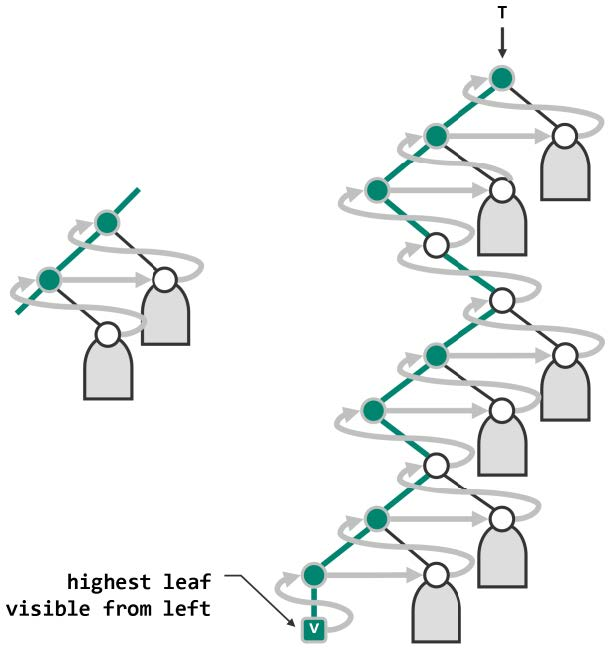

# 递归式

```C++
template <typename T, typename VST> //元素类型、操作器
void travPost_R(BinNodePosi(T) x, VST& visit) { //二叉树后序遍历算法（递归版）
    if (!x) return;
    travPost_R(x->lChild, visit);
    travPost_R(x->rChild, visit);
    visit(x->data);
}
```

# 迭代式

```C++
template <typename T> //在以S栈顶节点为根的子树中，找刡最高左侧可见叶节点
static void gotoHLVFL(Stack<BinNodePosi(T)>& S) { //沿递所遇节点依次入栈
    while (BinNodePosi(T) x = S.top()) //自顶而下，反复检查当前节点（即栈顶）
    if (HasLChild(*x)) { //尽可能向左
        if (HasRChild(*x)) S.push(x->rChild); //若有右孩子，优先入栈
        S.push(x->lChild); //然后才转至左孩子
    } else //实不得已
        S.push(x->rChild); //才向右
    S.pop(); //迒回之前，弹出栈顶的空节点
}

template <typename T, typename VST>
void travPost_I(BinNodePosi(T) x, VST& visit) { //二叉树的后序遍历（迭代版）
    Stack<BinNodePosi(T)> S; //辅助栈
    if (x) S.push(x); //根节点入栈
    while (!S.empty()) {
        if (S.top() != x->parent) //若栈顶非当前节点之父（则必为其右兄），此时需
            gotoHLVFL(S); //在以其右兄为根之子树中，找到HLVFL（相当于递归深入其中）
        x = S.pop(); visit(x->data); //弹出栈顶（即前一节点之后继），并讵问之
    }
}
```

> 迭代式思路示意

